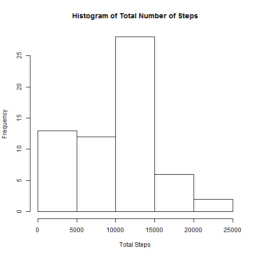
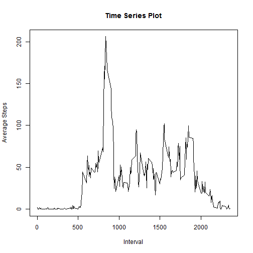
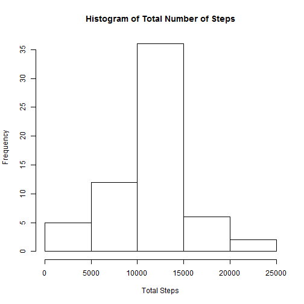
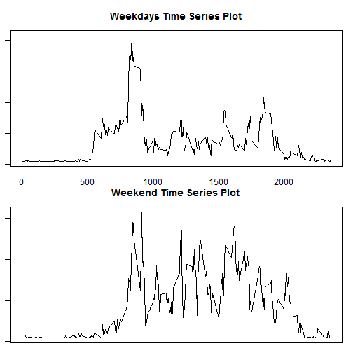

Loading and preprocessing the data
1.Load the data (i.e. read.csv())
2.Process/transform the data (if necessary) into a format suitable for your analysis

```r
activity<-read.csv("activity.csv") #Load Data
#Transform data into a format suitable for analysis 
activity$steps<-as.numeric(activity$steps) 
activity$interval<-as.numeric(activity$interval)
activity$date<-as.Date(activity$date)
activitydummy<-activity #Just a placeholder of original data
```


What is mean total number of steps taken per day?
For this part of the assignment, you can ignore the missing values in the dataset.
1.Make a histogram of the total number of steps taken each day

```r
total<-tapply(activity$steps, activity$date, sum, na.rm=TRUE) #Subset data without NA
hist(total, xlab="Total Steps", main="Histogram of Total Number of Steps") #Plot histogram
```

 

2.Calculate and report the mean and median total number of steps taken per day

```r
meantotal<-mean(total)
meantotal
```

```
## [1] 9354.23
```

```r
mediantotal<-median(total)
mediantotal
```

```
## [1] 10395
```

What is the average daily activity pattern?

1. Make a time series plot (i.e. type = "l") of the 5-minute interval (x-axis) and the average number of steps taken, averaged across all days (y-axis)


```r
intsteps<-tapply(activity$steps, activity$interval, mean, na.rm=TRUE, type="l")
plot(intsteps~as.numeric(names(intsteps)), type="l", xlab="Interval", ylab="Average Steps", main="Time Series Plot") #Plotting #1
```

 


```r
maxint<-names(intsteps[intsteps==max(intsteps)]) #Finding the interval with maximum number of steps
maxint
```

```
## [1] "835"
```

Imputing missing values

1. Calculate and report the total number of missing values in the dataset (i.e. the total number of rows with NAs)

```r
sum(!complete.cases(activitydummy))
```

```
## [1] 2304
```


2. Devise a strategy for filling in all of the missing values in the dataset. The strategy does not need to be sophisticated. For example, you could use the mean/median for that day, or the mean for that 5-minute interval, etc.

Will copy over the original dataset, then replace the missing values with a mean

3. Create a new dataset that is equal to the original dataset but with the missing data filled in.

```r
activitydummy$steps[is.na(activitydummy$steps)]<-mean(na.exclude(activity$steps))
```
  
4. Make a histogram of the total number of steps taken each day and Calculate and report the mean and median total number of steps taken per day. 

```r
totalcomplete<-tapply(activitydummy$steps, activitydummy$date, sum, na.rm=TRUE) #Subset data without NA
hist(totalcomplete,xlab="Total Steps", main="Histogram of Total Number of Steps")
```

 

```r
mean(totalcomplete)
```

```
## [1] 10766.19
```

```r
median(totalcomplete)
```

```
## [1] 10766.19
```
Do these values differ from the estimates from the first part of the assignment? 

*Yes*

What is the impact of imputing missing data on the estimates of the total daily number of steps?

*Imputting a missing data as a mean changes the total daily number of steps significantly*

Are there differences in activity patterns between weekdays and weekends?
For this part the weekdays() function may be of some help here. Use the dataset with the filled-in missing values for this part.
1. Create a new factor variable in the dataset with two levels -- "weekday" and "weekend" indicating whether a given date is a weekday or weekend day.

```r
weekdays1 <- c('Monday', 'Tuesday', 'Wednesday', 'Thursday', 'Friday')
dayindex<-factor((weekdays(activitydummy$date) %in% weekdays1),levels=c(FALSE, TRUE), labels=c('weekend', 'weekday'))
```


2. Make a panel plot containing a time series plot (i.e. type = "l") of the 5-minute interval (x-axis) and the average number of steps taken, averaged across all weekday days or weekend days (y-axis). 


```r
wkdaysteps<-tapply(activitydummy$steps[dayindex=="weekday"], activitydummy$interval[dayindex=="weekday"], mean, na.rm=TRUE, type="l")
wkendsteps<-tapply(activitydummy$steps[dayindex=="weekend"], activitydummy$interval[dayindex=="weekend"], mean, na.rm=TRUE, type="l")
par(mfcol=c(2,1))
par(mar=c(1,1,3,1))
plot(wkdaysteps~as.numeric(names(wkdaysteps)), type="l", xlab="Interval", ylab="Number of Steps", main="Weekdays Time Series Plot") #Plotting eekday Steps
plot(wkendsteps~as.numeric(names(wkendsteps)), type="l", xlab="Interval", ylab="Number of Steps", main="Weekend Time Series Plot") #Plotting Weekday Steps
```

 

